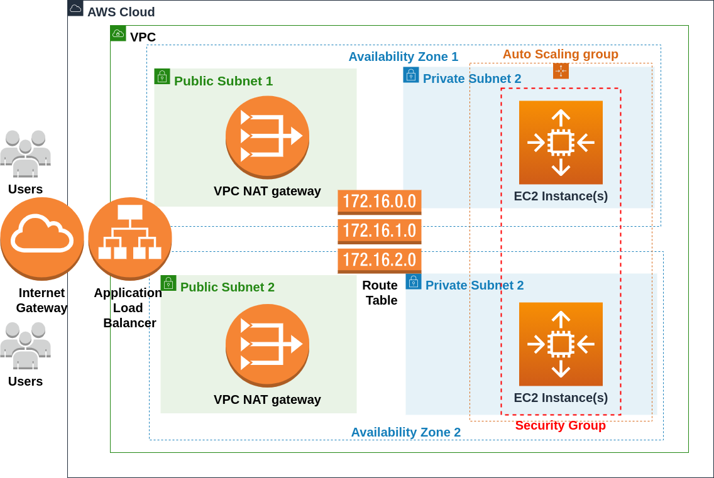

# Cloud Infrastructure as Code (IaC) Deployment

## Purpose
Deploy a website application on to AWS cloud infrastructure designed for high availability using AWS CloudFormation.

## Architecture Diagram


## Deployment Script Files
The deployment of cloud infrastructure relies on three CloudFormation template files contained in the repository:

- ```deploy-infra.yaml``` - Primary file used to deploy network infrastructure and server infrastructure using the two files below
  - Deploys the following infrastructure:
    - 2 Cloudformation Stacks
- ```network-infra.yaml``` - CloudFormation template used to deploy network infrastructure
  - Deploys the following infrastructure:
    - 1 Internet Gateway
    - 1 VPC
    - 2 Public Subnets
    - 2 Private Subnets
    - 2 NAT Gateways w/ 2 Associated Elastic IPs
    - 1 Public Route Table w/ Associated Routes
    - 2 Private Route Tables w/ Associated Routes
- ```server-infra.yaml``` - CloudFormation template used to deploy server infrastructure
  - Deploys the following infrastructure:
    - 1 LoadBalancer w/ 1 Listener and 1 Listener Rule
    - 1 AutoScaling Group
    - 1 AutoScaling LaunchConfiguration
    - 1 Target Group
    - 1 Instance Profile
    - 1 IAM Role
    - 2 Security Group
    - Optional: 1 Bastion Host EC2 Instance
    - Optional: 1 Bastion Host Security Group
    
## Usage of Scripts to Deploy a Website
Overview: The deployment involves taking a ```.zip``` of website files stored in an S3 Bucket and deploying the files into Autoscaling group instances running Apache.

Prerequisites:
- ```.zip``` containing website files
- Following files stored in S3:
  - ```.zip``` of website files
  - ```network-infra.yaml```
  - ```server-infra.yaml```
  - Optional:```KeyPair``` Name if creating a bastion host
  
Start deployment:
- Deploy ```deploy-infra.yaml``` template in AWS CloudFormation providing the ```.zip``` URI link, and URLs for  ```network-infra.yaml``` and ```server-infra.yaml```
-  Enter/Modify CloudFormation template parameters as necessary
  - Optionally create bastion host or not
  
Note: Deployment scripts have only been tested using a static website.
